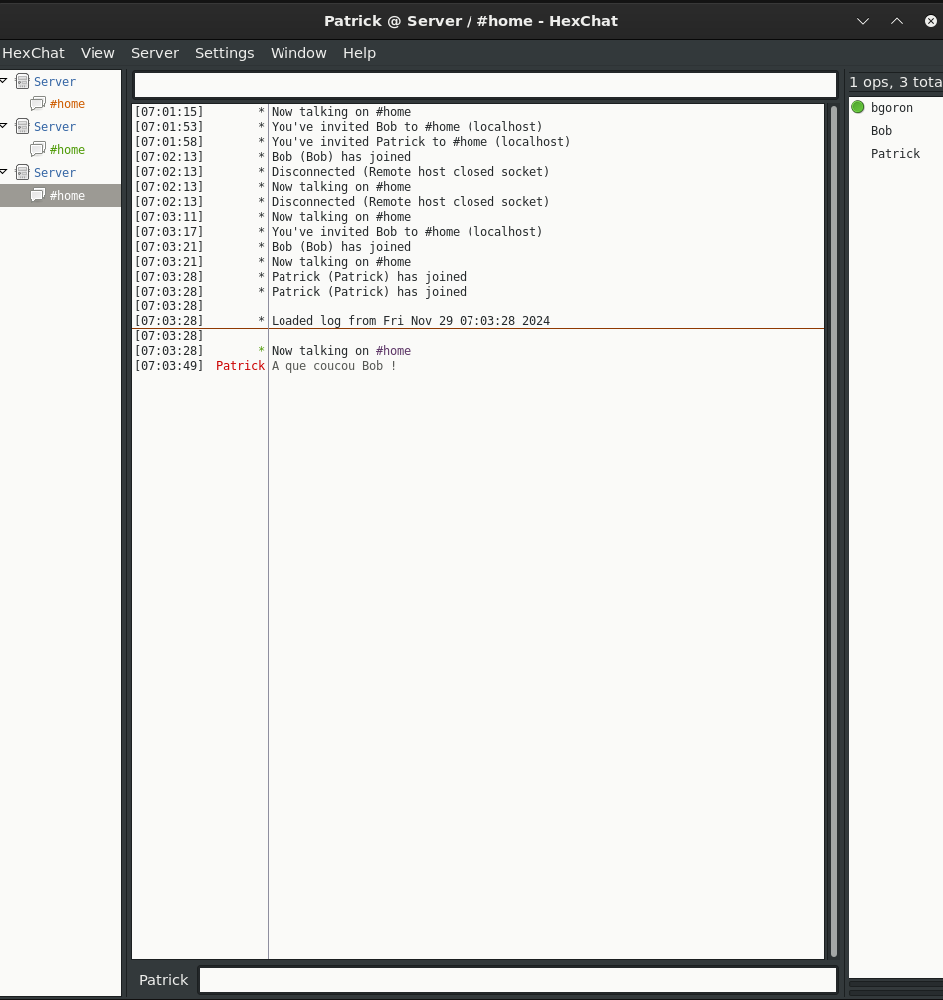
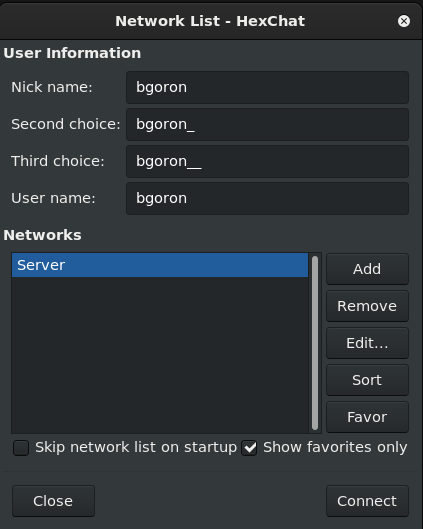
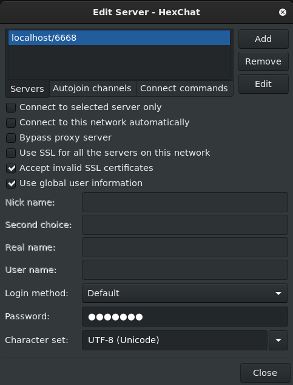

# ft_irc

**Description :**  

ft_irc est un projet conçu pour recréer un serveur IRC (Internet Relay Chat) conforme au RFC 1459. Ce serveur permet aux utilisateurs de se connecter, de rejoindre des channels, d'envoyer des messages privés, et de gérer divers événements en temps réel.



## **Introduction**

IRC est un protocole utilisé pour les communications en ligne en temps réel. Ce projet a été réalisé dans le cadre du cursus 42 et vise à construire un serveur minimaliste mais fonctionnel. ft_irc utilise la fonction **poll()** pour gérer plusieurs connexions simultanées et respecte le standard C++98.

---

## **Fonctionnalités**

- 🟢 Gestion des connexions multiples avec **poll()**.  
- 🟢 Commandes principales implémentées :  
  - **DIE** : Déconnexion propre du serveur.  
  - **INVITE** : Invitation a rejoindre un channel. 
  - **JOIN** : Rejoindre un channel.  
  - **KICK** : Expulser un utilisateur d'un channel.
  - **MODE** : Edite les modes d'un channel.   
  - **NICK** : Changer de pseudonyme.  
  - **PART** : Quitter un channel.
  - **PASS** : Sert a s'authentifier sur le server. 
  - **PRIVMSG** : Envoi de messages privés entre utilisateurs.
  - **TOPIC** : Edite le topic d'un channel.
  - **USER** : Changer de username.    
- 🟢 Support des channels multiples avec des permissions d'accès.  
- 🟡 Implémentation d'un bot interactif pour les commandes automatisées (bonus).
  - **INVOKE** : Invoque un bot helper.

---

### Usage :

```
make
./ircserv <port> <passwword>
```

<p align="center">
  
  
</p>
